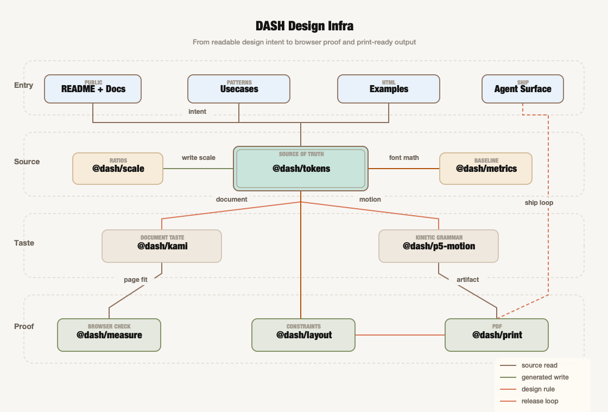

<div align="center" id="top">
  <br />
  
  <h1 align="center">DASH Design Infra</h1>
  <p align="center">
    <strong>给 agent 做视觉产物的基础设施，不是“看起来还行”的截图。</strong>
    <br />
    token、编辑型文档审美、p5.js 动态语法、固定画布校验、HTML 到 PDF，走同一条 Bun 路径。
  </p>

  <p align="center">
    <a href="./README.md">English</a> · <a href="./README-zh.md">中文</a> · <a href="./AGENTS.md">Agent Guide</a> · <a href="./docs/PUBLIC_CSO_AUDIT.md">CSO Audit</a>
  </p>

  <p align="center">
    
    
    
    
    
  </p>

  <p align="center">
    <a href="#快速开始">快速开始</a> ·
    <a href="#为什么存在">为什么存在</a> ·
    <a href="#能做什么">能做什么</a> ·
    <a href="#包说明">包说明</a> ·
    <a href="#优化循环">Loop</a> ·
    <a href="#公开信任边界">信任边界</a>
  </p>
  <br />
</div>

---

## 为什么存在

Agent 做视觉产物，常见失败方式都很无聊。

聊天窗口里看着还行，进浏览器就裁切。导出 PDF 后行距崩了。一个页面用了六套 spacing。动态 sketch 很酷，但下一次没人能复用。视频能在一台机器上渲染，换个人压缩就糊成马赛克。

`dash-design-infra` 是产物下面那层东西：

- token 把颜色、字号、间距、页面尺寸和 motion 值放在一个地方；
- 文档默认审美让 one-pager 和 report 像认真排过版；
- p5.js motion preset 把实验沉淀成可命名的动态语法；
- browser measurement 让固定画布在交付前就暴露溢出；
- print/PDF export 复用同一条 HTML 路径；
- 公开安全的 workflow 文档记录 motion / video 交付纪律。

这不是 theme pack。它是让设计产物经得起真实路径的底层机械结构。

<p align="right"><a href="#top">回到顶部</a></p>

## 快速开始

```bash
bun install
bun x playwright install chromium

bun tokens:build
bun metrics:build
bun typecheck
bun docs:links
bun security:scan
bun hackathon:score
```

检查公开固定画布路径：

```bash
bun measure:check -- examples/one-pager.html
bun print:render -- examples/one-pager.html /tmp/dash-one-pager.pdf --canvas=1684x1191
```

试动态 helper：

```ts
import { createMotionTimeline, createTileGrid, layoutTileFrame, p5MotionPresets } from '@dash/p5-motion';

const tiles = createTileGrid(720, 960, 3, 3);
const frame = layoutTileFrame(tiles, 0.42);
const timeline = createMotionTimeline(p5MotionPresets.electricArchive.timeline);
const state = timeline.atFrame(42);

console.log(p5MotionPresets.memoryWeatherReport.layers);
console.log(frame[0]);
console.log(state.phases.scanExposure.eased);
```

Agent 先读 [`AGENTS.md`](./AGENTS.md)。人类从这里开始就够。

<p align="right"><a href="#top">回到顶部</a></p>

## 能做什么

| 你要做 | 从这里开始 | 最后能保住什么 |
|---|---|---|
| 一页纸 brief 或报告 | [`examples/one-pager.html`](./examples/one-pager.html) | 能测量、能导出、不突然裁切的 HTML |
| 编辑型 deck / 页面产物 | [`@dash/kami`](./packages/kami) | 温润页面默认值、稳定层级、打印安全 tag |
| 动态海报 | [`@dash/p5-motion`](./packages/p5-motion) | 可复用 p5.js motion grammar，不是一坨一次性 sketch |
| 档案/证据视觉 | [`Electric Archive`](./usecases/p5js/electric-archive.md) | 档案面 + 信号面的 memory / retrieval / handoff 叙事 |
| 天气图式证据报告 | [`Memory Weather Report`](./usecases/p5js/weather-report.md) | 气压、锋面、雷达纹理和 forecast card |
| 高密度生成式视频 | [`Windburn Render Workflow`](./usecases/video/windburn-render-workflow.md) | 分块渲染、contact-sheet QA、微信码率压缩 |
| 有硬约束的页面 | [`@dash/layout`](./packages/layout) + [`@dash/measure`](./packages/measure) | 先解布局规则，再用真实浏览器验收 |

<p align="right"><a href="#top">回到顶部</a></p>

## 架构

事实源向下流动。

```text
Tokens / scale / metrics
        │
        ├── Kami document taste ───────> report、one-pager、deck-like page
        │
        ├── p5 motion grammar ─────────> poster、archive field、weather map
        │
        └── layout + measure + print ──> fixed-canvas check、PDF output
```

公开 docs 和 usecase 负责解释意图。packages 提供可复用部件。verification commands 证明输出路径真的能跑。

<p align="right"><a href="#top">回到顶部</a></p>

## 包说明

| 包 | 任务 | 核心依赖 |
|---|---|---|
| [`@dash/tokens`](./packages/tokens) | 颜色、字号、间距、页面尺寸和 motion 值 | `style-dictionary` |
| [`@dash/scale`](./packages/scale) | 生成字号和间距比例，支持 `--write` | `utopia-core` |
| [`@dash/metrics`](./packages/metrics) | 字体基线指标，不靠肉眼猜 | `@capsizecss/core` |
| [`@dash/kami`](./packages/kami) | report、letter、resume、portfolio、deck 的编辑型默认审美 | 无 |
| [`@dash/p5-motion`](./packages/p5-motion) | p5.js motion preset 和确定性 helper | peer `p5` |
| [`@dash/measure`](./packages/measure) | 固定画布 HTML 的浏览器溢出检查 | `playwright` |
| [`@dash/layout`](./packages/layout) | 硬几何约束布局 helper | `@lume/kiwi` |
| [`@dash/print`](./packages/print) | paged-media HTML 到 PDF 输出 | `pagedjs`, `playwright` |

<p align="right"><a href="#top">回到顶部</a></p>

## 优化循环

Hackathon loop 现在写成明确操作模型：review 一个 surface，apply 一个窄修复，score 证明变强，CI 复验，green 才 merge，然后下一轮。模型见 [`docs/HACKATHON_SDD_LOOP.md`](./docs/HACKATHON_SDD_LOOP.md)，ClawSweeper 参考映射见 [`docs/CLAW_SWEEPER_REFERENCE.md`](./docs/CLAW_SWEEPER_REFERENCE.md)。

本地 scoreboard proxy：

```bash
bun hackathon:score
```

它故意很直：如果一个 loop 不能提升公开清晰度、验证、可安装性或边界安全，就不值得吃掉下一个 30 分钟。

<p align="right"><a href="#top">回到顶部</a></p>

## 公开信任边界

这个 repo 是 public-facing，所以边界必须写死。

| Surface | 状态 |
|---|---|
| 私有本地路径 | 已扫描，策略禁止 |
| 原始视频 / 音频 | 刻意不进入仓库 |
| 私有客户文本 | 刻意不进入仓库 |
| secrets / env 文件 | ignore + scan，不提交 |
| 生成媒体 | 除非是刻意准备的小型公开 preview，否则不提交 |
| 依赖审计 | `bun audit --audit-level high`，当前 clean |
| Markdown link check | `bun docs:links`，当前 clean |
| 公开边界扫描 | `bun security:scan`，当前 clean |
| Hackathon score | `bun hackathon:score`，当前 maxed |
| 类型安全 | `bun typecheck`，当前 green |

公开安全姿态见 [`docs/PUBLIC_CSO_AUDIT.md`](./docs/PUBLIC_CSO_AUDIT.md)。安全问题报告见 [`SECURITY.md`](./SECURITY.md)。

<p align="right"><a href="#top">回到顶部</a></p>

## Agent 入口

[`AGENTS.md`](./AGENTS.md) 是给后续 agent 的契约：

- repo 提供什么；
- 默认验证命令；
- 哪些东西绝对不能提交；
- 如何新增公开 workflow；
- docs 和 example 的质量线。

Hackathon 目标在 [`docs/HACKATHON_GOAL.md`](./docs/HACKATHON_GOAL.md)。

<p align="right"><a href="#top">回到顶部</a></p>

## 目录结构

```text
.
├── AGENTS.md
├── docs/
│   ├── HACKATHON_GOAL.md
│   ├── PUBLIC_CSO_AUDIT.md
│   └── assets/
├── examples/
├── packages/
│   ├── kami/
│   ├── layout/
│   ├── measure/
│   ├── metrics/
│   ├── p5-motion/
│   ├── print/
│   ├── scale/
│   └── tokens/
├── usecases/
│   ├── p5js/
│   └── video/
├── README.md
├── README-zh.md
└── package.json
```

<p align="right"><a href="#top">回到顶部</a></p>

## 当前状态

已经可用：

- token 构建链路；
- `@dash/scale` 生成与 `--write`；
- capsize CSS 生成；
- Kami 启发的编辑型文档 preset；
- p5.js 动态 preset，包括 Electric Archive 和 Memory Weather Report；
- 视频工作流说明，包括分块渲染 QA 和交付压缩；
- 浏览器内溢出校验；
- 约束求解布局 helper；
- paged.js PDF 输出；
- 公开 example 和 usecase 文档；
- 安装、token build、metrics build、typecheck、dependency audit、docs link check、public-boundary scan、hackathon score 的 CI。

刻意留在仓库外：

- 原始 p5.js lab 源码；
- 参考视频与抽帧素材；
- 私有项目写作和客户材料；
- 由使用方管理的打印 vendor 资源。

<p align="right"><a href="#top">回到顶部</a></p>

## Hall of Fame

特别感谢 [@tw93](https://github.com/tw93)。[Kami](https://github.com/tw93/kami) 对这里的文档审美层影响很大；[Kaku](https://github.com/tw93/Kaku) 和 [Mole](https://github.com/tw93/Mole) 这类工具也实实在在参与了我们的日常工作流，让这个 repo 的方向更清楚。

这里是感谢与 attribution，不代表上游作者对本仓库代码负责。

<p align="right"><a href="#top">回到顶部</a></p>

## 贡献

见 [CONTRIBUTING.md](./CONTRIBUTING.md)。

一句话原则：改动尽量小，可回退，公开安全，并在真实路径上验证。

## 许可证

MIT。见 [LICENSE](./LICENSE)。
