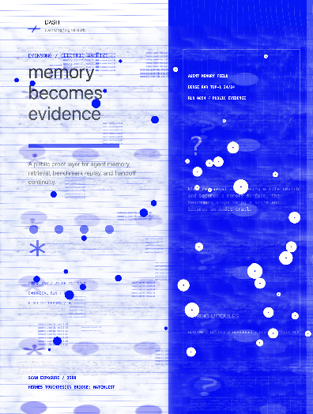

# Electric Archive

  

Electric Archive is a p5.js poster grammar for memory, retrieval, and handoff evidence.

It uses a split surface: a pale archive field on the left, an electric cobalt signal field on the right. The result feels like a report that has been scanned, stressed, and made alive by moving evidence traces.

## What It Does

- Keeps editorial text on a mostly white archive plane.
- Uses cobalt signal space for motion, nodes, scan wash, and metadata.
- Treats scratches, exposure, and sampled texture as atmosphere instead of UI chrome.
- Lets dots and trace lines move like a memory retrieval field.
- Works as a still poster or a controlled kinetic study.

## Layer Model

| Layer | Role |
|---|---|
| Archive plane | Paper-like white field, title, small metadata, proof text |
| Signal plane | Deep cobalt field, nodes, scan bands, trace texture |
| Evidence glyphs | Dots, rings, asterisks, small marks, and handoff hints |
| Scan exposure | Moving wash that makes the poster feel captured from a machine |
| Control layer | `scan exposure`, `signal stress`, and optional inversion |

## Use When

- You need to show memory becoming evidence.
- You want a technical report to feel more alive without becoming a dashboard.
- You need a p5.js motion reference for archive, retrieval, benchmark, or handoff visuals.

## Public Boundary

This usecase is distilled from an internal p5.js lab. The public repo keeps the preview, naming, and reusable motion grammar. It does not include private lab source files, reference videos, or local machine paths.

## Package Preset

Use `p5MotionPresets.electricArchive` from [`@dash/p5-motion`](../../packages/p5-motion).

## 中文

Electric Archive 是一个“档案面 + 信号面”的 p5.js 动态海报语法。左侧像被扫描过的白色证据页，右侧是钴蓝色信号场。它适合表达 memory、retrieval、handoff、benchmark evidence 这类不适合做成普通 dashboard 的内容。
