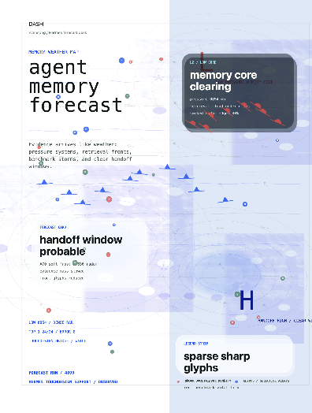

# Memory Weather Report

  

Memory Weather Report is a p5.js poster grammar for complex evidence.

It treats memory, benchmarks, retrieval pressure, and handoff risk as weather systems: fronts, pressure cells, radar texture, forecast cards, station glyphs, and slow map movement.

## What It Does

- Turns dense signals into a readable weather-map composition.
- Uses forecast cards to create hierarchy before the viewer reads the small data.
- Keeps the base mostly light so the page stays report-like, not dashboard-like.
- Uses radar haze and smoked glass sparingly for depth.
- Makes motion feel atmospheric: clouds drift, isobars breathe, glyphs pulse.

## Layer Model

| Layer | Role |
|---|---|
| Paper map | Calm white/blue base, large title, faint grid and coordinates |
| Weather mass | Radar bands, cloud texture, isobar motion, slow pressure systems |
| Forecast cards | Two or three soft cards that carry the main read |
| Sharp glyphs | Stations, fronts, wind vectors, and sparse red/blue markers |
| Smoked accent | A small dark radar area around the highest-pressure signal |

## Use When

- You need to explain risk, pressure, evidence density, or forecast state.
- A normal table would be accurate but emotionally dead.
- You want a dynamic report surface that still reads cleanly as a still image.

## Public Boundary

This usecase is distilled from an internal p5.js lab and a layer-design note. The public repo keeps the preview, naming, and reusable grammar. It does not include private source media, lab implementation files, or local machine paths.

## Package Preset

Use `p5MotionPresets.memoryWeatherReport` from [`@dash/p5-motion`](../../packages/p5-motion).

## 中文

Memory Weather Report 把复杂证据当成天气系统来表达：气压、锋面、雷达纹理、forecast card、站点符号和缓慢的地图运动。它适合风险、证据密度、系统健康、handoff 状态这类“表格能讲清楚，但看起来太死”的内容。
